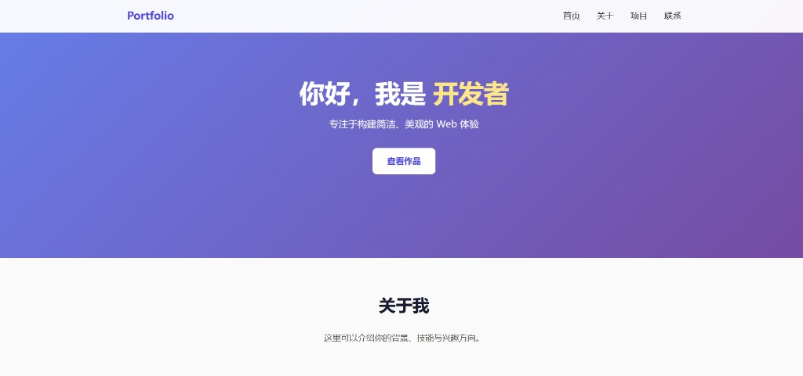
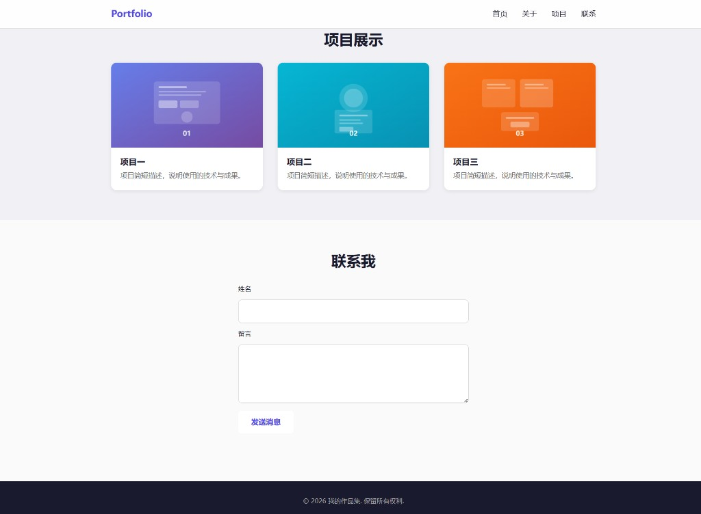

# 作品集网站

一个简洁、响应式的个人作品集网站模板，用于展示项目、技能与联系方式。

## 效果展示

### 首页与关于



### 项目展示与联系



## 项目结构

```
.
├── index.html          # 主页面
├── styles.css          # 样式文件
├── main.js             # 交互脚本
├── images/             # 图片资源目录
│   ├── project-placeholder.svg
│   ├── screenshot-hero.png
│   └── screenshot-projects.png
└── README.md           # 项目说明
```

## 功能特性

- 响应式布局，适配桌面与移动端
- 粘性导航栏与移动端汉堡菜单
- 项目展示卡片网格
- 联系表单（前端演示，无后端提交）
- CSS 重置与基础样式体系

## 运行方式

本项目为纯静态网站，无需构建工具。任选以下方式即可预览：

### 方式一：直接打开

双击 `index.html` 文件，在浏览器中打开。

### 方式二：本地开发服务器（推荐）

使用 Python 内置服务器：

```bash
# Python 3
python -m http.server 8080
```

然后在浏览器访问 [http://localhost:8080](http://localhost:8080)

或使用 Node.js 的 `npx`：

```bash
npx serve .
```

## 自定义指南

1. 修改 `index.html` 中的个人信息、项目描述与链接
2. 将项目截图放入 `images/` 目录，并更新 HTML 中的图片路径
3. 在 `styles.css` 中调整配色与字体以匹配个人品牌
4. 在 `main.js` 中扩展交互逻辑或接入真实表单后端

## 技术栈

- HTML5
- CSS3（Flexbox、Grid、媒体查询）
- 原生 JavaScript（DOM API）

## 许可证

MIT
